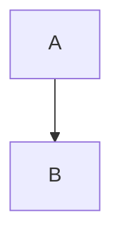

# TL;DR
ちょっと前にGitHubで使えるようになって全世界を大歓喜の渦に巻き込んだMermaidさん．
GitHubで使えるようになったのは大変嬉しい話ですが，他にどこで使えるのかというのがいまいちわからないので調べました．

## Mermaidってなに
ここでは知らない人のことは想定しないので[他の人の記事](https://zenn.dev/okazuki/articles/learning-mermaid)でも見てくれ．

こういうのを書くと
~~~

~~~

こういうのが出てくるんだ．

以上

# 使えるサービス
私の主観と偏見で調べてきました．このサービスでも使えるから足してくれって人がいたらコメントに書いてください．

|            | mermaid | URL                                         |
|------------|---------|---------------------------------------------|
| Qiita      | ○       | https://qiita.com/                          |
| Zenn       | ○       | https://zenn.dev/                           |
| Github     | ○       | https://github.com/                         |
| gitlab.com | ○       | https://gitlab.com/                         |
| esa.io     | ○       | https://esa.io/                             |
| HackMD     | ○       | https://hackmd.io/                          |
| stackedit  | ○       | https://stackedit.io/                       |
| dillinger  | ×       | https://dillinger.io/                       |
| Marxico    | ×       | http://marxi.co/                            |
| Editor.md  | ×       | http://editor.md.ipandao.com/en.html        |
| Jira       | ×       | https://www.atlassian.com/ja/software/jira/ |
| nortion    | ○       | https://www.notion.so/                      |

ちなみに私はZennとHackMDとGitHub/gitlabを使って生きているので，すべての環境でMermaidが使えそうです．
